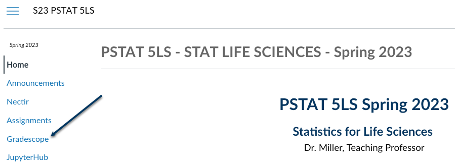

# Lab Notes

Use this place to take any notes during your lab section.

- Type any notes here
- Add new notes by using the dash `-` to create a list

# Lab Code

Use the chunks below to try out any code that you'd like. We have loaded the `penguins` data set for you in the first chunk, so you can try things out with this data.

```{r loadPenguins, error = T}
penguins <- read.csv("penguins.csv", stringsAsFactors = TRUE)
```

```{r tryIt1, error = T}
# Use this code chunk to make a table of the species variable in the penguins data

```

```{r tryIt2, error = T}
# Use this code chunk to make a two-way frequency table of the variables species and island in the penguins data

```

```{r tryIt3, error = T}
# This chunk is given to you to help you make a bar chart of the species variable in the penguins data. Try it out by hitting the green run button (and being sure that the data is in the environment or you'll get an error!)
barplot(table(penguins$species),
     xlab = "Species",
     ylab = "Frequency",
     main = "Bar Chart of Number of Penguins of Each Species 
            Observed",
     col = c("darkorange1", "mediumorchid2", "darkcyan"))
```

```{r tryIt4, error = T}
# Use this code chunk to get help with the barplot function

```

```{r tryIt5, error = T}
# Use this code chunk to view the summary of the flipper_length_mm variable in the penguins data

```

```{r tryIt6, error = T}
# Use this code chunk to view the summary and the standard deviation of the flipper_length_mm variable in the penguins data

```

```{r tryIt7, error = T}
# Use this code chunk to try out one (or all) of the specific number summary values, such as mean

```

```{r tryIt8, error = T}
# Use this code chunk to make a histogram of the variable flipper_length_mm in the penguins data. Don't forget a title using `main` and a x-axis label using `xlab`.

```

```{r tryIt9, error = T}
# Use this code chunk to make a boxplot of the variable flipper_length_mm in the penguins data. Don't forget a title using `main` and a y-axis label using `ylab`.

```

```{r tryIt10, error = T}
# This code chunk has the code to make a side-by-side boxplot of penguins body mass by the categorical variable penguins species
boxplot(penguins$body_mass_g ~ penguins$species,
        main = "Boxplots of Penguin Body Mass by Species",
        ylab = "Body mass (g)",
        xlab = "Species",
        col = c("darkorange1", "mediumorchid2", "darkcyan"))
```

```{r tryIt11, error = T}
# Use this code chunk to make a side-by-side boxplot of penguins flipper length by the categorical variable penguins island

```

# Code Cheat Sheet

## `$`
- tells R that we are looking for a variable in a particular data frame
- `data_set_name$data_set_variable`

## `table(data_set_name$data_set_variable)`
- creates a table of the frequencies of one categorical variable

## `table(data_set_name$data_set_variable, data_set_name$data_set_variable)`
- creates a two way table of the frequencies of two categorical variables

## `barplot(table(data_set_name$data_set_variable))`
- creates a barplot of a categorical variable

## `summary(data_set_name$data_set_variable)`
- creates the five number summary of a numeric variable

## `hist(data_set_name$data_set_variable)`
- creates a histogram of a numeric variable

## `boxplot(data_set_name$data_set_variable)`
- creates a boxplot of a numeric variable

## `boxplot(data_set_name$numeric_variable ~ data_set_name$categorical_variable)`
- creates side-by-side boxplots of a numeric variable grouped by a categorical variable

## Important plotting arguments

### `main = "Title of Your Graph in Double Quotes"`
- graph title that must be inside a set of double quotes

### `xlab = "x-axis Label of Your Graph in Double Quotes"`
- the x- (horizontal) axis label that must be inside a set of double quotes

### `ylab = "y-axis Label of Your Graph in Double Quotes"`
- the y- (vertical) axis label that must be inside a set of double quotes

# Wrap-Up and Submission

At the top of the document, make sure you've changed the `author` field to your name (in quotes!) and the `date` field to today's date. 

When you've finished the lab, click the **Knit** button one last time.<br />


Give yourself a high five - you just wrote code! 

### Submission instructions
<!-- This is a comment and will not show up in your document. Note that the
numbering here is all 1's. This will automatically be converted to 1, 2, etc.
when you knit the document; writing all 1's makes it so you don't have to
constantly update the numbering when you move things around in editing! -->

1. In the Files pane, check the box next to your `lab1report.pdf`: </br>
  
  

2. Click More > Export... </br>

   </br>

3. Click Download and save the file on your computer in a folder you'll remember and be able to find later. You can just call the file `lab1-report.pdf` or whatever else you'd like (as  long as you remember what you called it). 

</br>


## Submission to Gradescope

- Access Gradescope through Canvas



## Submit to Gradescope Continued

- Click on the assignment name (e.g., Lab 1 Report). 
- Click Submit PDF > Select PDF > locate the file > Upload PDF. You can only submit one PDF file per assignment. 
- On your screen, you should see a list of the questions/problems in your assignment and thumbnails of your PDF page(s). For each question, click the question on the left and the PDF page(s) that contains the answers on the right.
- Now, click Submit. When your submission is successful, you will be sent to a new page to view your submission, you’ll see a success message on your screen, and you’ll receive an email. If your submitted file looks good, you see the success message, and you get the confirmation email, you’re done!
- If you need to, select the Resubmit button in the bottom right corner of your screen below your submission. Then, repeat the steps above as many times as needed before the assignment due date passes. We will only see your most recent submission when we grade your lab report. All your past submissions are in your Submission History.